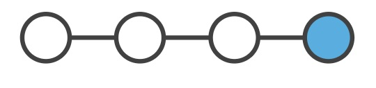
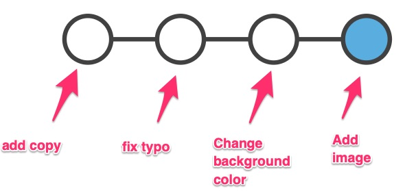
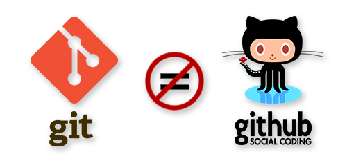
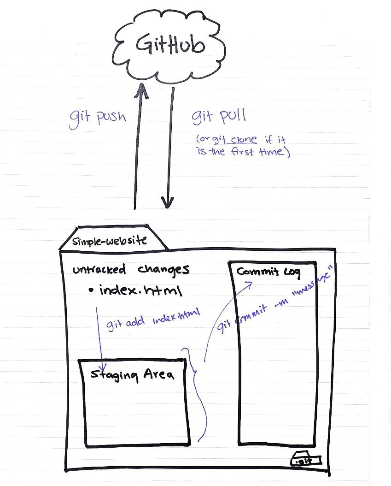
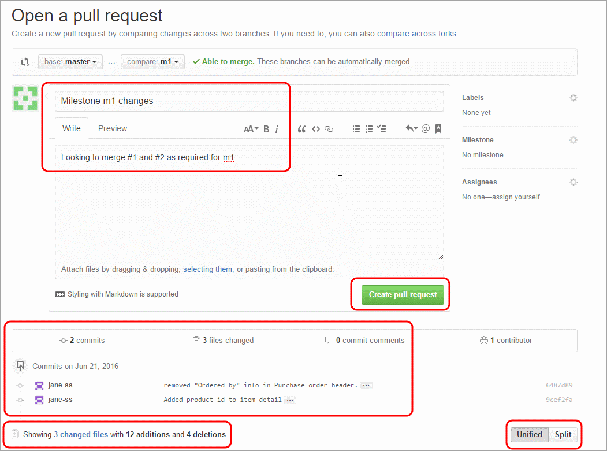

::: {.callout-note appearance="minimal"}
**Pre-work goal:** Understand what git *is*, build a mental model of how a repository works, and walk through the two workflows you'll use constantly. If you've played the [Terminal Trainer](game.qmd) 🎮, you've already *typed* most of this — here's what it all meant.
:::

## What is Git?

Keeping track of file versions is hard. Every researcher has seen (or made) a folder like this:

```
analysis_final.R
analysis_final_v2.R
analysis_final_v2_REAL.R
analysis_final_v2_REAL_jacobs_edits.R
```

**Git** is a fast, free version control system that solves this permanently. It tracks changes in your files, remembers every version, and lets multiple people (or you and an AI agent) work on the same project without trampling each other.

Here are the problems git solves:

#### Reverting to past save points (commits)

Git lets you make save points at any time. These are called **commits**. Once a save point is made, it's permanent — you can go back to it at any time, see exactly what the code looked like, or even start building off that version.

{fig-alt="A chain of commits, each a saved snapshot" width="75%"}

#### Remembering what each save point *meant* (commit messages)

Every commit has a description — a **commit message** — that says what changed and why: "add cost-effectiveness analysis", "fix join dropping rows."

{fig-alt="Commits with descriptive messages" width="75%"}

#### Comparing changes between save points (diff)

Git can show you the exact line-by-line changes (a **diff**) between any two points. This matters when you're tracking down when a bug appeared, catching up on a collaborator's progress — or **reviewing what an AI agent just did to your code** (a big theme of this course).

#### Working on parallel versions (branches)

Git lets you keep multiple versions of a project — **branches** — side by side in the same folder, and toggle between them. Split off a branch to experiment or build a new feature; merge it back into the `main` branch when you're ready.

#### Fearlessness

Because git makes it easy to return to a known good state, you can experiment — rewrite that function, try a different model structure — without worrying you'll be unable to undo it. **This fearlessness is exactly what makes it safe to let an AI agent write code**: nothing it does is irreversible.

## Git versus GitHub

These get conflated constantly. They're different things:

- **Git** is the version control software — a technology that runs on your computer.
- **GitHub** is a website where git repositories are stored and shared — a place to back up your work, collaborate, and review changes.

{fig-alt="Git is not the same as GitHub" width="60%"}

You can use git without GitHub. But together they give you offsite backup, collaboration, and **pull requests** — the review mechanism we'll use all course.

## Vocabulary

The basics:

| Term | Meaning |
|------|---------|
| **Git** | Version control software |
| **Repository ("repo")** | A folder whose changes git is tracking (via a hidden `.git` folder inside it) |
| **Commit** | A saved snapshot of your files, with an id and a **commit message** describing the change |
| **Diff** | The line-by-line difference between two versions |

Working with others (or other machines):

| Term | Meaning |
|------|---------|
| **GitHub** | A place to host git repositories and collaborate |
| **Local repository** | The copy of a repo on your computer |
| **Remote repository** | The copy stored elsewhere (usually GitHub) that your local repo syncs with |
| **Clone** | Download an entire remote repo to use locally |
| **Push / pull** | Send your commits to the remote / fetch and merge the remote's commits |

## Anatomy of a repository

This is the mental model that makes everything click. A repo has three zones, and your work flows through them:

{fig-alt="Working directory, staging area, and repository" width="85%"}

1. **The working directory** — your files, as they are right now.
   - `git init` turns the current folder into a repo (creates the hidden `.git` folder).
   - `git clone <url>` copies an existing repo (e.g., from GitHub) onto your computer.
2. **The staging area** — where you gather the changes you're about to save.
   - `git add <filename>` stages one file; `git add .` stages everything changed.
3. **The commit** — the saved snapshot.
   - `git commit -m "commit message"` saves everything staged.
   - `git log` shows the history of commits.

::: {.callout-tip}
## Pro tip: `git status` after every command
While you're learning, run `git status` constantly — after every single command if you like. It shows which zone everything is in (untracked → staged → committed) and usually tells you what to type next. It is impossible to overuse.
:::

## Branching

### Why branches?

A branch is a pointer to a snapshot of your changes. When you want to add a feature or fix a bug — big or small — you spawn a branch to encapsulate the work. This keeps unstable code out of `main`, and lets several lines of work proceed in parallel without interfering.

### How branches work

Every repo starts with a `main` branch. When you create a branch, you branch *off* the latest commit, and your work accumulates there while `main` stays untouched:

```
            ○──○──○   ← feature/cost-model (your experiment)
           /
  ○──○──○──○──○       ← main (stable, untouched)
```

If the experiment works, you **merge** it back. If it doesn't, you delete the branch — `main` never knew.

### How merging works

When it's time to merge, git combines the branch's commits with whatever has happened on `main` since you branched. Usually this is automatic. Occasionally both branches changed the same lines and git asks you to resolve a **merge conflict** — it looks scarier than it is, and we'll cover it on course day if it comes up.

### Pull requests

You *can* merge branches directly on your machine — but the better habit, and the one this course runs on, is the **pull request (PR)**: you push your branch to GitHub and open a request to merge it into `main`. GitHub shows the full diff, lets you (and collaborators) comment line by line, and records the decision.

{fig-alt="Opening a pull request on GitHub" width="85%"}

In PR language: **base** is the branch you're merging *into* (almost always `main`); **compare** is your feature branch — where you're merging *from*.

### Branch commands

```bash
git branch                  # list branches (* marks where you are)
git switch -c <branchname>  # create a new branch and switch to it
git switch <branchname>     # switch to an existing branch
git branch -d <branchname>  # delete a branch (after merging)
```

::: {.callout-note}
You'll also see `git checkout -b <name>` and `git checkout <name>` in older tutorials — same thing, older syntax. `switch` is the modern, clearer command.
:::

## Reference workflow 1 · Linear (solo, simple)

The simplest rhythm, for a project where you work alone directly on `main`:

```bash
# 1. go to your project
cd ~/path/to/project

# 2. make sure you didn't forget to commit anything
git status

# 3. pull the latest from GitHub (important if you work on two machines)
git pull

# 4. ...do a discrete chunk of work (say, add an analysis)...

# 5. check status, then stage what you changed
git status
git add analysis.R
git status

# 6. commit with a descriptive message
git commit -m "Add new analysis"

# 7. push back to GitHub
git push
```

## Reference workflow 2 · Feature branches (recommended)

The workflow we use all course — every piece of work gets its own short-lived branch, merged back through a pull request:

```bash
# 1. always start from an up-to-date main
git switch main
git pull

# 2. create a branch named for the work
git switch -c cost-model

# 3. work in discrete chunks; commit (and push) as you go
git status
git add analysis.R
git commit -m "Add blank cost model script"
git push -u origin cost-model      # first push sets up the remote branch

# ...more work...
git add analysis.R
git commit -m "Add Markov transition matrix"
git push
```

When the work is done, make sure everything is committed and pushed (`git status`), then open a **pull request** from your branch back to `main` on GitHub — you can do it on the website, or from the terminal:

```bash
gh pr create --fill      # open the PR
gh pr diff               # read the full diff — the review step!
gh pr merge --squash --delete-branch
```

Finally, sync your local `main` with what you just merged:

```bash
git switch main
git pull
```

Each feature branch is short-lived: one branch → one PR → merged → deleted. (An alternative you'll sometimes see is one long-lived branch per team member — fine for some teams, but feature branches keep history cleaner, and they're the pattern we'll use with AI agents on course day.)

::: {.callout-tip}
## Why this matters for the course
On course day, the "feature branch" worker won't always be you — it'll often be an **AI agent** working under your direction. The workflow is identical: the agent works on a branch, you read the diff in a pull request, and *you* decide what merges. Learn this rhythm now and the agentic version will feel completely natural.
:::

## Practice it for real

You've read it — now type it. Fifteen minutes, using the repo you made in [Setup](setup.qmd):

1. `cd agentic-warmup` (or make a fresh repo)
2. Run the **feature-branch workflow** above end to end: branch → edit README → commit → push → PR → read the diff → merge → sync main.
3. Post a ✅ in the [Slack channel](https://join.slack.com/t/agenticaiworkinggroup/shared_invite/zt-45afgdq1j-R8PNZz3SqUZuzgamkYDttQ) when your PR is merged.

## Further reading

- [Understanding Git Conceptually](https://www.sbf5.com/~cduan/technical/git/) — the best "how it actually works" explainer.
- [Official git reference](https://git-scm.com/docs) and the free [Pro Git book](https://git-scm.com/book).
- [Oh Shit, Git!?!](https://ohshitgit.com/) — what to do when things go sideways (bookmark this).
- [GitHub's git cheat sheet](https://training.github.com/downloads/github-git-cheat-sheet.pdf) (PDF).
- [Happy Git with R](https://happygitwithr.com/) — git for R users, by Jenny Bryan.

::: {.recap}
**What to remember**

- Git = save points (**commits**) + change review (**diffs**) + parallel work (**branches**) + fearlessness.
- **Git** is the software; **GitHub** is where repos live and where **pull requests** happen.
- The three zones: **working directory → staging area → commit**. When lost, `git status`.
- **Feature-branch workflow**: branch → small commits → push → PR → read the diff → merge → sync.
:::

*Adapted from the git & GitHub materials I taught in previous SMDM reproducible-programming workshops.*
