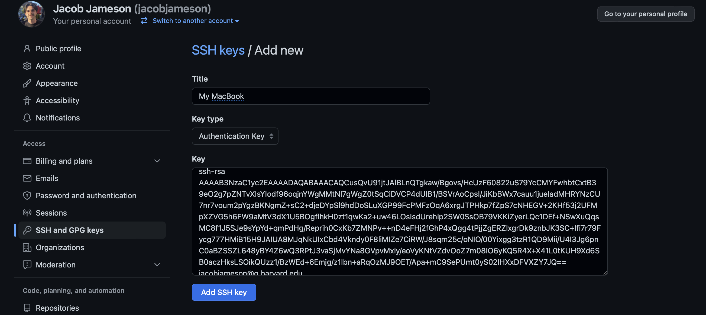

::: {.callout-important}
## Please complete this *before* the course
We're fully remote on Zoom, and setup problems are slow to debug for 30 people at once. Work through every part below and run the **[verification checklist](#verify-your-setup)** at the end. If something fails, **post the error in the [course Slack channel](https://join.slack.com/t/agenticaiworkinggroup/shared_invite/zt-45afgdq1j-R8PNZz3SqUZuzgamkYDttQ)** — we'll debug it there before course day rather than during class.
:::

::: {.callout-tip}
## Never used a terminal? Play first.
If commands like `cd` and `git commit` are new to you, spend 15 minutes in the [**Terminal Trainer**](game.qmd) 🎮 — a safe, in-browser terminal that teaches every command this page uses. Then come back here and do it for real.
:::

You'll set up five things, in order: a **terminal**, **git**, a **GitHub account** (connected by **SSH**), the **`gh` CLI**, and **Claude Code**.

## Part 0 · A terminal

- **macOS:** open **Terminal** (Applications → Utilities → Terminal), or install [iTerm2](https://iterm2.com/).
- **Windows:** install [**Git for Windows**](https://gitforwindows.org) — **make sure you include Git Bash in your installation!** Git Bash is the terminal you'll use for everything below.
- **Linux:** your existing terminal is fine.

## Part I · Installing Git

::: {.panel-tabset}
### macOS

1. Install Homebrew following the instructions at <https://brew.sh/>.
2. Open Terminal and check if git is already installed:

```bash
git --version
```

3. **If not**, install git with:

```bash
brew install git
```

Then verify it's installed by running `git --version` again.

### Windows

Installing [Git for Windows](https://gitforwindows.org) (Part 0) also installs git. Open **Git Bash** and verify:

```bash
git --version
```

### Linux

```bash
sudo apt-get update && sudo apt-get install -y git   # Debian/Ubuntu
```
:::

## Part II · Creating a GitHub Account

1. Go to [GitHub](http://github.com/).
2. Click the **"Sign Up"** button.
3. Follow the on-screen instructions to create your account.

Already have one? Skip ahead.

## Part III · Git Setup

Configure git with your name and email address. **Be sure to use the same email associated with your GitHub account:**

```bash
git config --global user.name "YOUR NAME"
git config --global user.email "YOUR EMAIL ADDRESS"
git config --global init.defaultBranch main
```

## Part IV · SSH Keys

To write code locally and push to GitHub (or pull from GitHub) without constantly entering a username and password, we set up **SSH keys**.

> SSH keys come in pairs: a **public key** that gets shared with services like GitHub, and a **private key** that is stored only on your computer. If the keys match, you're granted access. The cryptography behind SSH keys ensures that no one can reverse-engineer your private key from the public one.

These steps are a simplification of [GitHub's documentation](https://docs.github.com/en/authentication/connecting-to-github-with-ssh) — feel free to follow that instead if you prefer.

### Step 1 · Check if you already have keys

```bash
ls -al ~/.ssh/
```

If you see files like `id_rsa` and `id_rsa.pub` (or `id_ed25519` / `id_ed25519.pub` — just a different encryption algorithm), you already have a key pair: **skip to Step 3.** Otherwise, read on.

### Step 2 · Create new SSH keys

Run the following, replacing the email with **the same email you used for GitHub**:

```bash
ssh-keygen -t rsa -b 4096 -C "your_email@example.com"
```

You'll see a prompt like this — **just hit enter** to save in the default location:

```
Enter file in which to save the key (/Users/you/.ssh/id_rsa):
```

Then it asks for a passphrase. We're **not** using one here — leave it blank and hit enter twice:

```
Enter passphrase (empty for no passphrase):
Enter same passphrase again:
```

You'll finish with a "randomart" image — that means it worked.

### Step 3 · Add your key to GitHub

Print your **public** key:

```bash
cat ~/.ssh/id_rsa.pub
```

Copy the output **exactly** (it starts with `ssh-rsa` and ends with your email). Then go to <https://github.com/settings/keys>, hit **"New SSH key"**, paste it into the box, give it a title like *"My MacBook Pro"* (so you know which computer it came from), and hit **"Add SSH key"**.

{fig-alt="GitHub's New SSH key form with the public key pasted in" width="85%"}

### Step 4 · Verify it worked!

```bash
ssh -T git@github.com
```

(The first time, type `yes` when asked about the host fingerprint.) A successful connection looks like:

```
Hi username! You've successfully authenticated, but GitHub does not
provide shell access.
```

::: {.callout-note}
## Recap: what did we just do?
You created a public/private key pair in the hidden `~/.ssh/` folder. `id_rsa.pub` is your **public key** — share it far and wide (you just gave it to GitHub). `id_rsa` is your **private key** — it never leaves your computer. The pair is mathematically linked: your computer signs with the private key, GitHub verifies with the public one, and the two can now communicate securely without a password every time.
:::

## Part V · The `gh` CLI and Claude Code

Two more tools and you're done.

### The GitHub CLI (`gh`)

`gh` lets you create repos and open pull requests from the terminal — we use it throughout the course.

::: {.panel-tabset}
### macOS
```bash
brew install gh
```

### Windows
```bash
winget install --id GitHub.cli
```

### Linux
See [cli.github.com](https://cli.github.com/) for your package manager.
:::

Then log in (choose **GitHub.com → SSH → your key** when prompted — it'll pick up the key you just made):

```bash
gh auth login
```

### Claude Code

Claude Code is the AI agent we'll use on course day. It needs [Node.js](https://nodejs.org/) (LTS) first:

```bash
brew install node          # macOS
# or: winget install OpenJS.NodeJS.LTS   (Windows)
```

Then install and start it once to sign in:

```bash
npm install -g @anthropic-ai/claude-code
claude
```

Follow the browser prompt to authenticate with your Anthropic account. You'll need an account with access to Claude Code — see [claude.com/claude-code](https://claude.com/claude-code) for current options.

::: {.callout-note}
## Using a different agent?
The course teaches with Claude Code, but the mechanics are the same in [OpenAI's Codex CLI](https://developers.openai.com/codex/cli) and similar tools. We standardize on one so the hands-on parts run smoothly — install Claude Code even if you use something else day-to-day.
:::

## Verify your setup

Run each command. You should get a version number or sensible output — **not** "command not found."

```bash
git --version
ssh -T git@github.com
gh --version
gh auth status
node --version
claude --version
```

Then confirm the full loop — create a repo, commit, and push it to your GitHub:

```bash
mkdir agentic-warmup && cd agentic-warmup
git init
echo "# Warmup" > README.md
git add README.md
git commit -m "First commit"
gh repo create agentic-warmup --public --source=. --push
```

If that last command printed your new repo's URL, **you're fully set up.** 🎉 Post a ✅ in the [Slack channel](https://join.slack.com/t/agenticaiworkinggroup/shared_invite/zt-45afgdq1j-R8PNZz3SqUZuzgamkYDttQ). (You can delete the test repo afterward with `gh repo delete agentic-warmup --yes`.)

::: {.recap}
Setup complete when: `git`, `gh`, `node`, and `claude` all report versions; `ssh -T git@github.com` greets you by username; `gh auth status` shows you're logged in; and you created + pushed a test repo.
:::

## Trouble?

| Symptom | Fix |
|---------|-----|
| `command not found: git/gh/claude` | The tool didn't install or isn't on your PATH. Reinstall; on Windows make sure you're in **Git Bash**. |
| `Permission denied (publickey)` | Your SSH key isn't on GitHub (redo Part IV Step 3), or you created it under a different name. |
| `gh auth login` won't open a browser | Choose "paste an authentication token" and follow [these steps](https://cli.github.com/manual/gh_auth_login). |
| `claude` says not authenticated | Run `claude` (no args) and complete the browser sign-in. |
| Corporate laptop blocks installs | Post in the Slack channel — we'll find a workaround, or use a personal machine if possible. |

**Next up:** [② Terminal Trainer 🎮](game.qmd) · [③ Git & GitHub Basics](git-basics.qmd)
